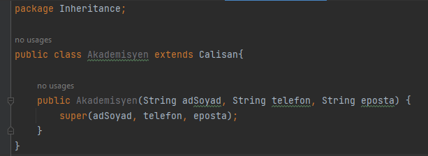

# Inheritance(Kalıtım)

Yukarıdaki diyagrama göre kalıtım prensiplerini uyguladık ve kodlamayı yaptık. 

# Kalıtım (Inheritance)
Kalıtım, programlama ortamında da gerçek hayattaki tanımına benzer bir işi gerçekleştirir. Bir sınıfın başka bir sınıftan kalıtım yapması demek, kalıtımı yapan sınıfın diğer sınıftaki nitelik ve davranışlarını kendisine alması demektir. Kalıtımı yapan sınıfa alt sınıf, kendisinden kalıtım yapılan sınıfa ata sınıf dersek, ata sınıfta tanımlı olan herşeyin alt sınıf için de tanımlı olduğunu söyleyebiliriz. 

# - Super Anahtar Kelimesi
Bir sub class bir super classtan kalıtım alıyorsa kalıtım aldığı constucter metodunu kendi içersinde kullanmak zorunda.
Super anahtar kelimesi sadece constructer metotlar içersinde çalışan bir anahtar kelimesidir. Super anahtar kelimesi bir üst sınıfın constructer metodunu referans alır.

# - Kalıtım Türleri
Tek Yönlü Kalıtım (Single Inheritance)
Bir sınıfın başka bir sınıfı genişlettiği alt ve ata sınıf ilişkisini ifade eder.

# - Çoklu Kalıtım (Multiple Inheritance)
Bir sınıfın birden fazla sınıfı miras almasını ifade eder; bu, bir alt sınıfın iki ata sınıfa sahip olduğu anlamına gelir.

Not : Java çoklu kalıtımı desteklemez. (Interface kullanılır)

# - Çok Seviyeli Kalıtım (Multilevel Inheritance)
Bir sınıfa ait alt sınıfın başka sınıfları genişletmesine denir.

# - Hiyerarşik Kalıtım (Hierarchical Inheritance)
Birden fazla sınıfın aynı sınıfı genişlettiği bir alt ve üst sınıf ilişkisini ifade eder.

# - Hibrit Kalıtım (Hybrid Inheritance)
Programda birden fazla kalıtım türünün kombinasyonuna denir. Örneğin, A ve B sınıfı, C sınıfını genişletir ve başka bir D sınıfı, A sınıfını genişletir, bu bir hibrit kalıtım örneğidir, çünkü bu, tek yönlü ve hiyerarşik kalıtımın bir birleşimidir.

