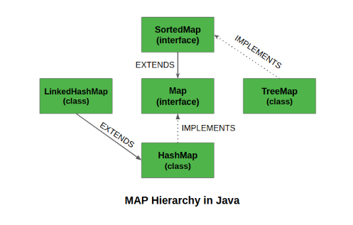
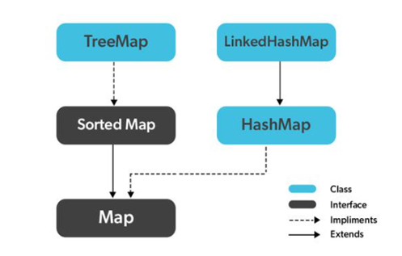

# MAP

Java'da, java.util paketinde bulunan Map Arayüzü, bir anahtar ve bir değer arasındaki eşlemeyi temsil eder. Java Map arayüzü, Collection arayüzünün bir alt türü değildir. Bu nedenle diğer koleksiyon türlerinden biraz farklı davranır. Bir **map** benzersiz anahtarlar içerir.

Mapler, sözlükler gibi anahtar-değer(key-value) ilişkilendirme eşlemeleri için mükemmeldir. Mapler, anahtarlara göre arama yapmak için veya birisi öğeleri anahtarlara göre almak ve güncellemek istediğinde kullanılır. Bazı yaygın senaryolar aşağıdaki gibidir:

- Hata kodları ve açıklamaları haritası.
- Posta kodları ve şehirler haritası.
- Yöneticiler ve çalışanlar haritası. Her yönetici (anahtar), yönettiği çalışanların (değer) bir listesiyle ilişkilendirilir.
- Sınıflar ve öğrenciler haritası. Her sınıf (anahtar) bir öğrenci listesiyle (değer) ilişkilendirilir.

Maplerin karakteristik özellikleri:

1. Bir Map yinelenen anahtarlar içeremez ve her anahtar en fazla bir değerle eşlenebilir. Bazı uygulamalar HashMap ve LinkedHashMap gibi null anahtar ve null değerlere izin verir, ancak bazıları TreeMap gibi izin vermez.
2. Bir eşlemenin sırası belirli uygulamalara bağlıdır. Örneğin, TreeMap ve LinkedHashMap öngörülebilir sıralara sahipken, HashMap değildir.
3. Java'da Map'i uygulamak için iki arayüz vardır. Bunlar Map ve SortedMap arayüzleridir ve üç sınıftan map oluşturulabilir: HashMap, TreeMap ve LinkedHashMap.

 

Maplerde kullanılan bazı genel metodlardan bahsedelim:

- **clear:** Map içinde bulunan bütün değerleri siler.
- **containsKey (Object key):** Belli bir anahtar daha önceden girilmiş mi sorgular.
- **containsValue (Object value):** Belli bir obje daha önceden girilmiş mi sorgular.
- **get (Object key):** Anahtara karşılık gelen objeyi döndürür.
- **put (Object key, Object value):** Anahtar — değer ikilisini kayıt eder.
- **remove (Object key):** Belli bir anahtara karşılık gelen değeri siler.
- **size:** O zaman kadar kayıt edilmiş anahtar — değer ikili sayısını verir.

Hatırlarsanız Collectionlarda liste, set veya queue içerisindeki değerleri gezmek için Iterator sınıfından bir nesne üretip while döngüsü ile listemizin içersindeki elemanları gezebiliyorduk. Burada durum farklı.
Map nesnesinde işlem yaparken anahtar ve değer ikilisi olduğu için işlemimizi şu şekilde yapabiliriz: 

    Map<Integer, String> rMap = new HashMap<>();
    rMap.put(1, "one");
    rMap.put(2, "two");

    for(Map.Entry<Integer, String> kv : rMap.entrySet()) {
        System.out.print("Key: " + kv.getKey() + ", ");
        System.out.println("Value: " + kv.getValue());
    }

Şeklinde bir for döngüsü ile map içersindeki anahtar ve değer değerlerini gezip işlem yapabiliriz.

